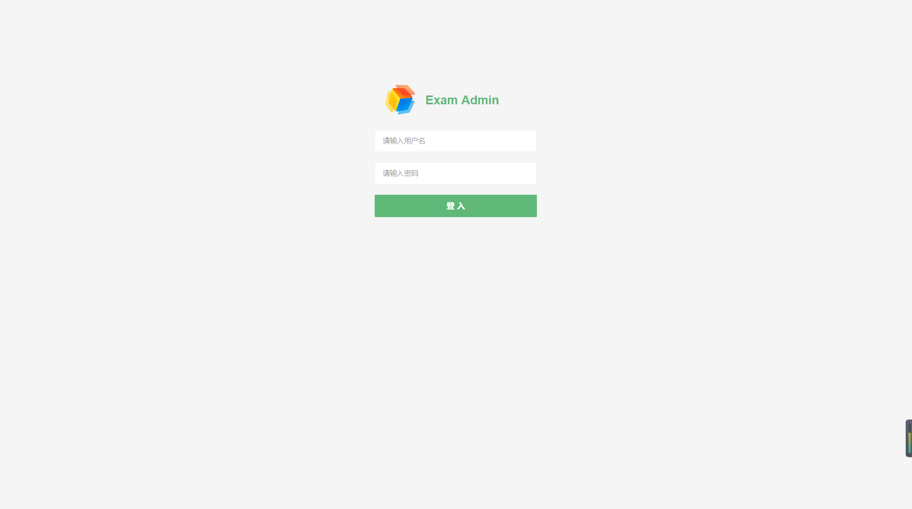
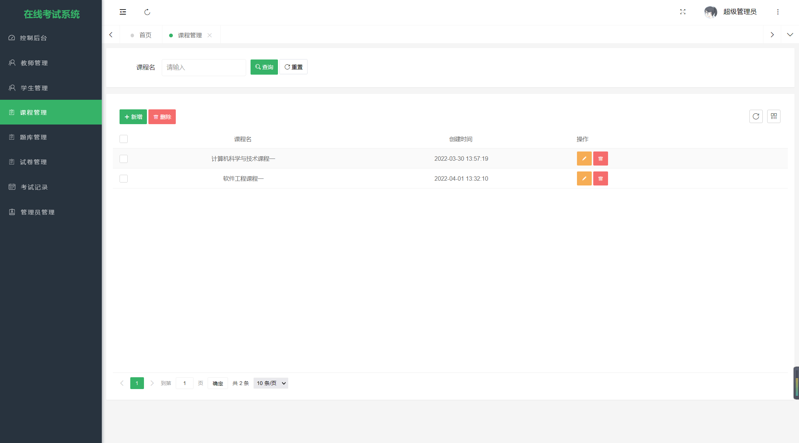
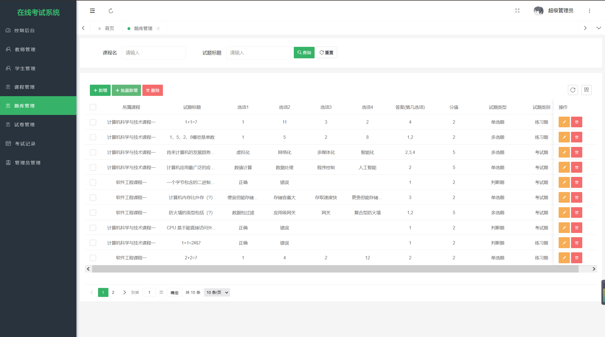
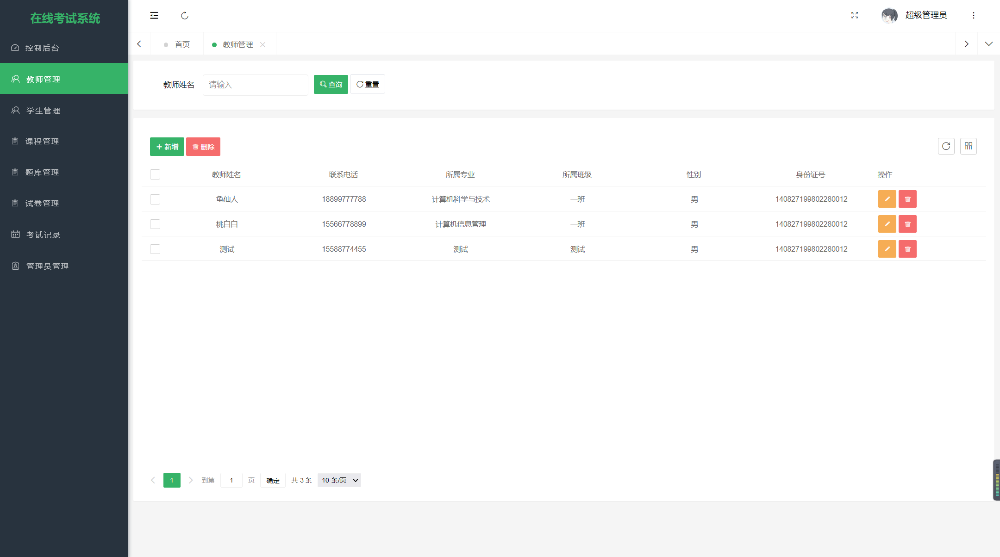
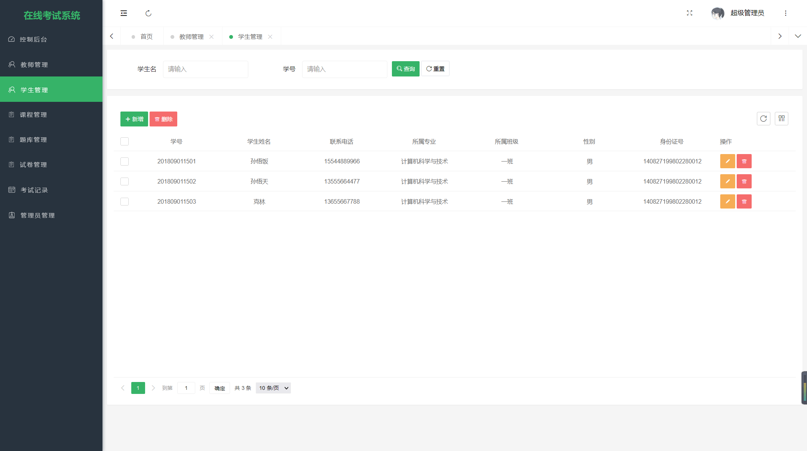
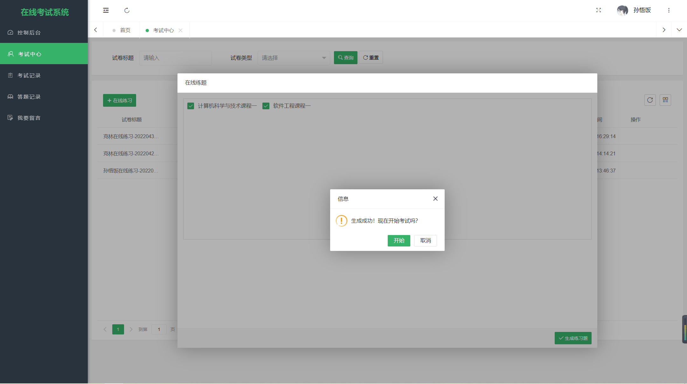
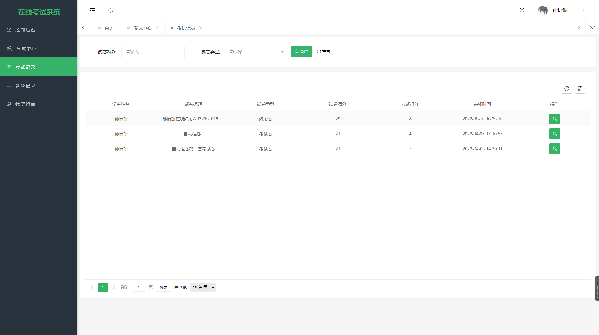
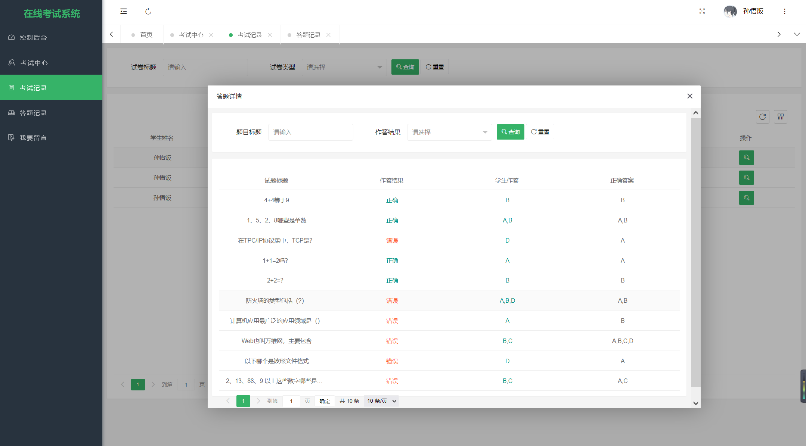

# 基于SpringBoot的在线考试系统


#### 介绍
```
本系统后台系统主要使用Java语言
整体架构采用：SpringBoot + MyBatisPlus + MySQL数据库
```


项目设计为B/S结构，

基于JavaEE的在线考试系统将传统的考试流程与网络技术相结合，实现考试模式无纸化、网络化、自动化。通过此系统教师可以根据教学需要简单快捷地创建考试，减少组织考试的工作量，提高工作效率，还可以进行学情分析、提高教学质量。

学生不仅可以在线考试，还可以查看成绩、在线练题，掌握自身学习情况。设计一个在线考试系统能够打破传统考试的诸多限制，给学生和教师带来便利。


#### 系统技术栈

SpringBoot + MyBatisPlus + Thymeleaf+ Layui + PearAdmin + jQuery + JavaScript +  MySQL 

#### 参考使用说明


#### 项目截图

##### 管理员端截图

|  |  |
| ----------------------------------------------- | ----------------------------------------------- |
|  |  |
|  |  |


##### 学生端截图

|  |   |
| ----------------------------------------------- | ------------------------------------------------ |
|  |  |


#### 参与贡献

1.  斗佛